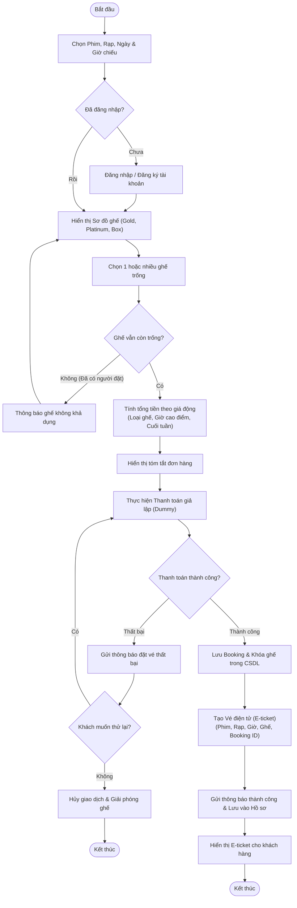

```mermaid
flowchart TD
    Start([Bắt đầu]) --> Browse["Chọn Phim, Rạp, Ngày & Giờ chiếu"]
    Browse --> AuthCheck{"Đã đăng nhập?"}
    
    AuthCheck -- "Chưa" --> Login["Đăng nhập / Đăng ký tài khoản"]
    Login --> SeatMap
    AuthCheck -- "Rồi" --> SeatMap["Hiển thị Sơ đồ ghế (Gold, Platinum, Box)"]
    
    SeatMap --> SelectSeats["Chọn 1 hoặc nhiều ghế trống"]
    SelectSeats --> ValidCheck{"Ghế vẫn còn trống?"}
    
    ValidCheck -- "Không (Đã có người đặt)" --> AlertSeat["Thông báo ghế không khả dụng"]
    AlertSeat --> SeatMap
    
    ValidCheck -- "Có" --> CalcPrice["Tính tổng tiền theo giá động\n(Loại ghế, Giờ cao điểm, Cuối tuần)"]
    CalcPrice --> ConfirmOrder["Hiển thị tóm tắt đơn hàng"]
    ConfirmOrder --> Payment["Thực hiện Thanh toán giả lập (Dummy)"]
    
    Payment --> PayCheck{"Thanh toán thành công?"}
    PayCheck -- "Thất bại" --> NotifyFail["Gửi thông báo đặt vé thất bại"]
    NotifyFail --> RetryCheck{"Khách muốn thử lại?"}
    RetryCheck -- "Có" --> Payment
    RetryCheck -- "Không" --> ReleaseSeat["Hủy giao dịch & Giải phóng ghế"]
    ReleaseSeat --> EndFail([Kết thúc])
    
    PayCheck -- "Thành công" --> SaveDB["Lưu Booking & Khóa ghế trong CSDL"]
    SaveDB --> GenTicket["Tạo Vé điện tử (E-ticket)\n(Phim, Rạp, Giờ, Ghế, Booking ID)"]
    GenTicket --> NotifySuccess["Gửi thông báo thành công & Lưu vào Hồ sơ"]
    NotifySuccess --> ShowTicket["Hiển thị E-ticket cho khách hàng"]
    ShowTicket --> EndSuccess([Kết thúc])
```